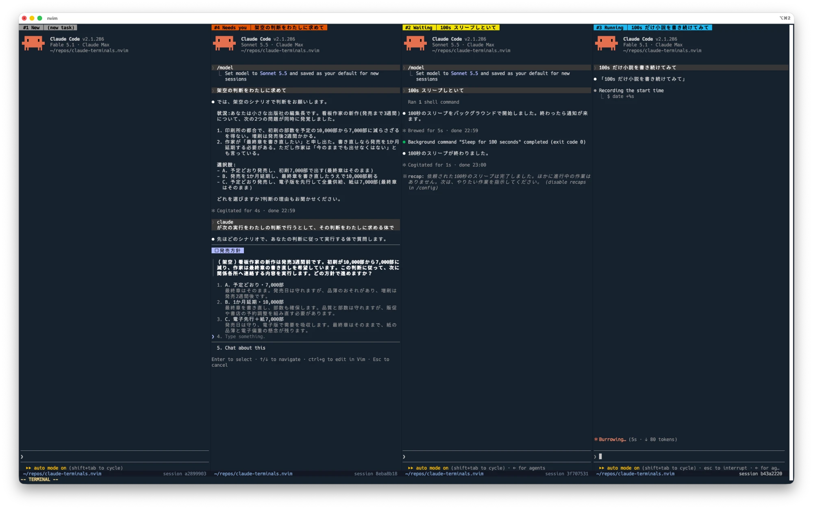
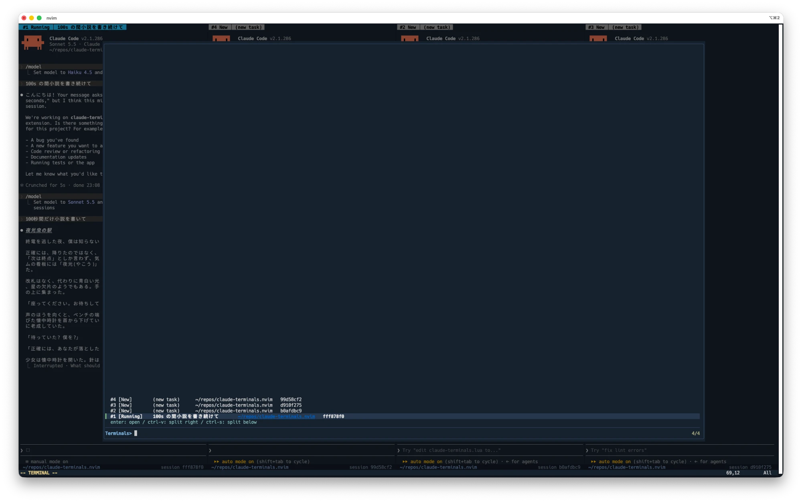
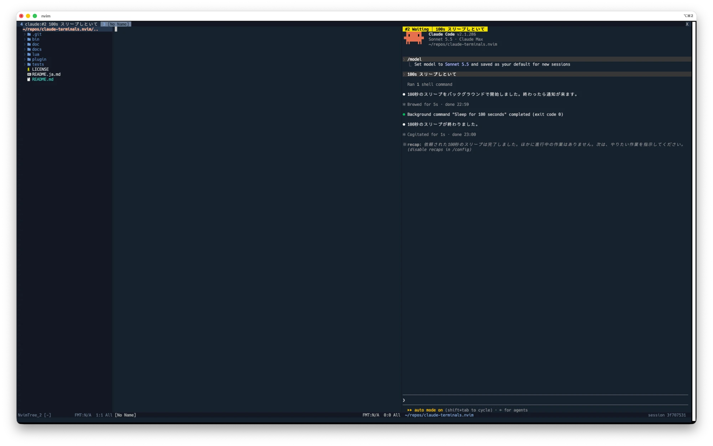

# claude-deck.nvim

[English](README.md) | 日本語

Neovim のターミナルで [Claude Code](https://docs.claude.com/en/docs/claude-code) のセッションを複数並べて動かし、どのセッションが自分を待っているかをひと目で分かるようにするプラグインです。名前の deck は、複数のセッションを並べて見渡す場所という意味です。

- **状態がひと目で分かる**: 各ターミナルの winbar に番号・状態・タスク名を（状態ごとの色で）表示し、ステータスラインに cwd と session id を表示します
- **デスクトップ通知**: セッションが入力待ちになったときや、許可を求めているときに通知します（今見ているターミナルは除く）
- **複数のセッション**: 右や下に分割して増やせます。`:q` で閉じても裏で動き続け、ピッカーから呼び戻せます
- **好きなディレクトリで開く**: ディレクトリを選んで新しいターミナルを開けます
- **セッションの分岐**: 今のセッションを分岐させた新しいターミナルを開けます（`--resume <id> --fork-session`）
- **集中モード**: ターミナルの cwd で「ファイルツリー ｜ エディタ ｜ ターミナル」を並べた新しいタブを開き、閉じると元の画面構成に戻ります
- **セッション間の連携**: ターミナル内の Claude が `ct list` / `ct read <番号>` で他のセッションの様子を確認できます



## 必要なもの

必須:

- Neovim 0.11 以降
- [Claude Code](https://docs.claude.com/en/docs/claude-code)（`claude` が `PATH` にあること）

任意（なくても動きます）:

- [fzf-lua](https://github.com/ibhagwan/fzf-lua): 分割キー付きのピッカー。ない場合は `vim.ui.select` を使います
- [nvim-tree.lua](https://github.com/nvim-tree/nvim-tree.lua): 集中モードのファイルツリー。ない場合は netrw を使います
- [zoxide](https://github.com/ajeetdsouza/zoxide): `pick_dir()` の候補にディレクトリを追加します
- [jq](https://jqlang.org/): `:ClaudeDeck settings` の JSON を整形して表示します
- デスクトップ通知: macOS では `osascript`（標準搭載。最前面のアプリの判定に `lsappinfo` も使います）、Linux では `notify-send`。`notify.notifier` で独自の通知方法も指定できます

フックスクリプトと `ct` は `nvim --server` を呼ぶ POSIX `sh` スクリプトです。Claude Code から見える `PATH` に `nvim` が必要です。

## インストール

[lazy.nvim](https://github.com/folke/lazy.nvim) の場合:

```lua
{
    "tbsmcd/claude-deck.nvim",
    cmd = "ClaudeDeck",
    -- 任意: ピッカー用の fzf-lua、集中モードのツリー用の nvim-tree.lua
    -- 一緒にインストールする場合はコメントを外す:
    -- dependencies = { "ibhagwan/fzf-lua", "nvim-tree/nvim-tree.lua" },
    opts = {},
    keys = {
        { "<leader>cc", function() require("claude-deck").toggle() end, desc = "Claude: 開く / 移動 / 追加" },
        { "<leader>cv", function() require("claude-deck").new("right") end, desc = "Claude: 右に新規" },
        { "<leader>cs", function() require("claude-deck").new("below") end, desc = "Claude: 下に新規" },
        { "<leader>cl", function() require("claude-deck").list() end, desc = "Claude: 一覧" },
        { "<leader>cd", function() require("claude-deck").pick_dir() end, desc = "Claude: ディレクトリを選んで新規" },
        { "<leader>cf", function() require("claude-deck").fork() end, desc = "Claude: セッションを分岐" },
        { "<leader>cr", function() require("claude-deck").rename() end, desc = "Claude: タスク名を変更" },
        { "<leader>co", function() require("claude-deck").focus() end, desc = "Claude: 集中モード" },
    },
}
```

キーマップはプラグイン側では設定しません。

オプションは `opts` に書きます（[設定](#設定)を参照）。例:

```lua
opts = {
    dir_roots = { "~/src" },
    labels = { waiting = "入力待ち", attention = "確認待ち" },
},
```

## 使い方

| Lua API | コマンド | 説明 |
| --- | --- | --- |
| `toggle()` | `:ClaudeDeck` | ターミナルの外では、表示中のターミナルへ移動するか、新しく開きます。ターミナルの中では右に追加します |
| `new(where?)` | `:ClaudeDeck new [right\|below]` | 今の window を分割して新しいターミナルを開きます |
| `list(opts?)` | `:ClaudeDeck list` | ターミナルを選んで表示します（非表示のものも含む） |
| `pick_dir(opts?)` | `:ClaudeDeck dir` | ディレクトリを選んで新しいターミナルを開きます |
| `fork(where?)` | `:ClaudeDeck fork` | 今のセッションを分岐させた新しいターミナルを開きます |
| `rename()` | `:ClaudeDeck rename` | 今のタスク名を変更します |
| `show_settings()` | `:ClaudeDeck settings` | Claude Code に渡す設定の JSON（hook と権限）を表示します |
| `focus()` | `:ClaudeDeck focus` | 集中モードを切り替えます |
| `show(id, where?)` | `:ClaudeDeck show <番号>` | 番号を指定してターミナルを表示します |

`where` を指定しない場合、新しいターミナルは次の場所に開きます。

- ターミナルの中にいるとき: 右に分割
- 空の無名バッファにいるとき（Neovim の起動直後など）: その場で開く（window が 1 つなら全画面）
- それ以外: 右端（エディタの幅の `width_ratio` の割合）

fzf-lua のピッカーでは、`enter` で上のルールどおりに開き、`ctrl-v` で右に、`ctrl-s` で下に分割して開きます。



#### 集中モード

`focus()` を実行すると、ターミナルの cwd で「ファイルツリー ｜ エディタ ｜ ターミナル」を並べた新しいタブを開きます。そのタブでもう一度実行すると、元の画面構成に戻ります。



ターミナルの window を `:q` で閉じても、非表示になるだけです。Claude のセッションは動き続け、状態の更新や通知も続きます。`list()`（`:ClaudeDeck list`）で呼び戻せます。終了するには Claude で `/exit` を実行してください。

ターミナルが最後の 1 枚の window でも同じです。`:q`（`ZZ`、`<C-w>q`、`:x` も同様）で Neovim は終了せず、空の window が残ります。裏で動いているターミナルの数はメッセージで表示されます。Neovim を終了するには `:qa` を使ってください。空の window でもう一度 `:q` すると Neovim が終了し、Claude のセッションもすべて終了します。この挙動は `keep_alive_on_quit` で切り替えられます。

### ウィンドウの操作

ターミナルの中で押したキーは Claude に送られます。ウィンドウを操作するときは、先にターミナルモードから抜けてください。

| キー | 動作 |
| --- | --- |
| `<C-q>` | ターミナルモードを抜ける（claude-deck のターミナルだけ。`keymaps.normal_mode`） |
| `<C-\><C-n>` | ターミナルモードを抜ける（Neovim 標準） |
| `<C-]>` | Claude に `<Esc>` を送る（claude-deck のターミナルだけ。`keymaps.send_esc`）。2 回押すと `Esc Esc` になる |
| `<C-w>h` / `<C-w>j` / `<C-w>k` / `<C-w>l` | 別の window へ移動（ノーマルモード） |
| `<C-w><` / `<C-w>>` / `<C-w>-` / `<C-w>+` | サイズを変更（ノーマルモード。`10<C-w>>` のように回数も指定可） |
| `<C-w>=` | window の大きさをそろえる |
| 境界線をマウスでドラッグ | サイズを変更 |

ターミナルの window に戻ると、自動でターミナルモードになります（`auto_insert`）。

ターミナルモードのまま window を操作したい場合は、`keymaps.window = "<C-w>"` を設定してください。その代わり、Claude Code の `Ctrl+W`（単語の削除）は使えなくなります。

`'equalalways'` が有効でも、ターミナルを開いたときに他の window の大きさは変わりません。分割はターミナルの領域の中で行います。

#### 参考: ターミナルモードから `<Esc>` と `<C-h/j/k/l>` を使う設定

作者は次のようなグローバルなキーマップを使い、`<Esc>` でターミナルモードを抜け、`<C-h/j/k/l>` でどのモードからでも window を移動しています。参考までに載せます。

```lua
-- <Esc> でターミナルモードを抜ける（Claude への <Esc> は <C-]> で送る）
vim.keymap.set("t", "<Esc>", [[<C-\><C-n>]])

-- ノーマルモードとターミナルモードで <C-h/j/k/l> で window を移動する
for _, key in ipairs({ "h", "j", "k", "l" }) do
    vim.keymap.set("n", "<C-" .. key .. ">", "<C-w>" .. key)
    vim.keymap.set("t", "<C-" .. key .. ">", [[<C-\><C-n><C-w>]] .. key)
end
```

この設定にすると、次のキーは Claude Code に届かなくなります: `Esc`（中断。`Esc Esc` で巻き戻し）、`Ctrl+K`（行末まで削除）、`Ctrl+L`（再描画）、`Ctrl+H`（多くのターミナルでは Backspace）。また、claude-deck 以外のすべてのターミナルにも適用されます。

> [!NOTE]
> Neovim のターミナルは `<Esc>` を Claude に送ります（中断）。ターミナルモードの `<Esc>` を自分でノーマルモードへの移行に割り当てている場合は、`<C-]>` で Claude に `<Esc>` を送れます（2 回押すと `Esc Esc`）。

### 会話をさかのぼる

Claude Code には 2 つの表示方式があり、claude-deck は既定で従来の表示（classic）で起動します（`renderer`）。

**classic（既定）**: 会話はすべてターミナルのバッファに残ります。ターミナルモードを抜けて（`<C-q>`）、いつもの Neovim の操作が使えます。`j` / `k`、`<C-u>` / `<C-d>`、`gg` / `G` で移動、`/` で検索、`v` と `y` でコピー。`i` で入力に戻ります。

**fullscreen**: 会話の履歴は Claude Code が持ち、バッファには今の画面の分しか残りません。Claude Code の中でスクロールします。`PageUp` / `PageDown`（Mac では `Fn+↑` / `Fn+↓`）、`Ctrl+End` で最新へ、`Ctrl+O` の transcript 表示（`j` / `k` で移動、`/` で検索）、またはマウスホイール。

| | classic | fullscreen |
| --- | --- | --- |
| ちらつき | 出力中にちらつくことがある | ちらつかない |
| 入力欄の位置 | 会話の末尾に続く。会話が window に収まる間は上のほうにあり、あふれてからは下に落ち着く | 常に画面の下 |
| 履歴の場所 | ターミナルのバッファ（最大 `scrollback` 行） | Claude Code が持つ。バッファには 1 画面分だけ |
| スクロール・検索・コピー | Neovim のノーマルモード（`j` / `k`、`/`、`y`） | `PageUp` / `PageDown`、`Ctrl+O` の transcript、マウスホイール |
| マウスのクリック | Neovim が受け取る | Claude Code が受け取る |
| 長い会話 | 描き直しの跡が、重複した行としてスクロールバックに残ることがある | 見えている部分だけを描くので重くならない |

フルスクリーン表示にする場合や、Claude Code 側の設定（`tui`）に任せる場合は、次のように設定します。

```lua
require("claude-deck").setup({ renderer = "fullscreen" }) -- または renderer = false
```

`renderer = false` のときは、環境変数を変更しません。Neovim の環境に `CLAUDE_CODE_NO_FLICKER` があればそれが使われ、なければ Claude Code の `tui` の設定に従います。

表示方式は環境変数 `CLAUDE_CODE_NO_FLICKER`（classic は `0`、fullscreen は `1`）で Claude に渡します。この環境変数は `tui` の設定より優先されます。変更は、そのあとに開いたターミナルから反映されます。

### 状態

| 状態 | 意味 | きっかけ | 通知 |
| --- | --- | --- | --- |
| New | 起動した直後で、まだプロンプトを送っていない | 起動 / `SessionStart` | |
| Running | Claude が作業している | `UserPromptSubmit`, `PostToolUse` | |
| Waiting | Claude が応答を終え、次のプロンプトを待っている | `Stop` | あり |
| Needs you | 作業の途中で、あなたの回答（許可の確認や質問への返答）を待って止まっている | `Notification` | あり |
| Exited | Claude のプロセスが終了した | プロセスの終了 | |

「Waiting」は、Claude が実行の順番を待っているという意味ではありません。あなたがプロンプトを送るまで、何も進みません。

タスク名は最初のプロンプトの先頭部分です（スラッシュコマンドは使いません）。`/clear` するとリセットされます。

各ターミナルの表示は 2 行です。

```
 #4 Needs you │ 確認してからマイグレーションを実行   ← winbar
 ~/src/app                      session 317dbc5c   ← ステータスライン
```

`statusline = false` にした場合や、`'laststatus'` が 3（全体で 1 本のステータスライン）の場合は、cwd を winbar の右側に表示します。window が狭いときは、cwd を短縮形にするか省きます。ターミナルのバッファ名は `claude:#<番号> <タスク名>` になるので、タブラインや他のステータスラインでも読みやすく表示されます。

状態名は `labels` で変更できます（[設定](#設定)を参照）。

### 通知

次の条件をすべて満たすときだけ、通知を出しません。

1. Neovim にフォーカスがある（`FocusGained` / `FocusLost`）
2. 今の window にそのターミナルが表示されている
3. macOS の場合、Neovim を動かしているターミナルアプリが最前面にある（フォーカスの変化を伝えないターミナルへの対策として `lsappinfo` で確認します）

### Claude 用の `ct` コマンド

ターミナルの中では `ct` が `PATH` に入っており、`--append-system-prompt` でそのことを Claude に伝えています。

```sh
ct list            # 全ターミナルの番号・状態・タスク名・cwd・session_id・transcript のパス
ct read 2 [件数]   # ターミナル #2 の直近の会話（既定 20 件）
```

どちらも許可の確認なしで実行できます。たとえば「#1 でやっている作業と矛盾しないか確認して」のように頼めます。


> [!WARNING]
> `ct read` は Claude Code の transcript ファイルを読み取ります。このファイルの形式は公開された仕様ではないため、変わる可能性があります。

## 設定

既定値:

```lua
require("claude-deck").setup({
    cmd = { "claude" },
    claude_settings = true, -- hook と `ct` の権限を `claude --settings` で渡す
    title_width = 60, -- タスク名として保持する文字数。winbar では幅に合わせてさらに切り詰める
    statusline = true, -- window のステータスラインに cwd と session id を表示する（false なら cwd を winbar に表示）
    width_ratio = 0.4,
    dir_roots = {}, -- 例: { "~/src" }。直下のディレクトリを pick_dir() の候補にする
    zoxide = true, -- `zoxide query --list` の結果も pick_dir() の候補にする
    labels = {
        idle = "New",
        running = "Running",
        waiting = "Waiting",
        attention = "Needs you",
        exited = "Exited",
        untitled = "(new task)",
    },
    notify = {
        enabled = true,
        states = { "waiting", "attention" },
        skip_when_watching = true,
        notifier = nil, -- function({ title, subtitle, body, state, terminal })
    },
    keymaps = { -- ターミナルの中だけで有効なキー。false で無効
        normal_mode = "<C-q>",
        window = false, -- 例: "<C-w>"
        send_esc = "<C-]>", -- Claude に <Esc> を送る
    },
    renderer = "classic", -- "classic" | "fullscreen" | false（Neovim の環境の CLAUDE_CODE_NO_FLICKER、なければ Claude Code の `tui` に従う）
    scrollback = 100000, -- ターミナルのバッファの 'scrollback'（上限 100000）。false なら変更しない
    auto_insert = true, -- ターミナルの window に入ったらターミナルモードにする
    keep_alive_on_quit = true, -- 最後の window で :q しても Neovim を終了せず、動いているターミナルを非表示にする
    picker = "auto", -- "auto" | "fzf-lua" | "select"
    focus = {
        tree = "auto", -- "auto" | false | function(cwd)
    },
    cli = {
        enabled = true, -- `ct` を PATH に入れ、許可の確認なしで実行できるようにする
        system_prompt = true, -- `ct` のことを Claude に伝える
    },
})
```

状態名を日本語にする例:

```lua
opts = {
    labels = {
        idle = "新規",
        running = "実行中",
        waiting = "入力待ち",
        attention = "確認待ち",
        exited = "終了",
        untitled = "(新しいタスク)",
    },
}
```

### ハイライト

状態の既定の色は [Okabe-Ito](https://jfly.uni-koeln.de/color/) のパレットをもとに、色相だけでなく明るさでも区別できるようにしており、色覚の違いがあっても見分けられます。

| グループ | 既定 |
| --- | --- |
| `ClaudeDeckIdle` | グレー |
| `ClaudeDeckRunning` | 空色 |
| `ClaudeDeckWaiting` | 黄色 |
| `ClaudeDeckAttention` | 朱色 |
| `ClaudeDeckExited` | 暗いグレー |
| `ClaudeDeckCwd` | `Directory` へのリンク |

## 仕組み

- 各ターミナルは `claude --settings <json>` で起動します。この JSON で [hook](https://docs.claude.com/en/docs/claude-code/hooks) を登録し、hook が `bin/claude-deck-hook` を呼びます。このスクリプトが `$NVIM` 経由（`nvim --server $NVIM --remote-expr`）でイベントを Neovim に伝えます。`~/.claude/settings.json` は変更しないので、他の場所で起動した `claude` には影響しません。
- ターミナルは `$CLAUDE_DECK_ID` で識別します。

### `--settings` を使わない場合

`claude_settings = false` にすると、`--settings` を付けずに `claude` を起動します。hook が届かないため、状態表示・通知・タスク名・`fork()` は動かず、`ct` も実行のたびに許可の確認が出ます。

これらを使いたい場合は、自分の Claude Code の設定（`~/.claude/settings.json` など）に hook を登録してください。登録する JSON は `:ClaudeDeck settings` で確認できます。hook のスクリプトは claude-deck の外では何もしないので、全体の設定に登録しても安全です。

## 制約

- Claude を中断しても `Stop` hook が発火しないため、次のプロンプトを送るまで状態が「Running」のままになります。
- macOS で、ターミナルアプリの中でタブやペインを切り替えても、フォーカスが外れたとは判定されません。
- ターミナルは 1 つの Neovim の中だけで管理しているため、Neovim を終了すると消えます（セッションは `claude --resume` で再開できます）。`:qa`（または動いているターミナル以外の window での `:q`）で Neovim を終了すると、確認なしで Claude のセッションもすべて終了します。
- `:q!` と `ZQ` はターミナルのバッファを破棄するため、Neovim が終了しない場合でもその Claude のセッションは終了します。

## ヘルプ

Neovim の中でも、同じ内容のドキュメントを読めます。英語版と日本語版があり、日本語版は次のコマンドで開けます。

```vim
:help claude-deck@ja
```

`set helplang=ja,en` にしておくと、`:help claude-deck` で日本語版が開きます。

## ヘルスチェック

```vim
:checkhealth claude-deck
```

## 開発

```sh
sh tests/smoke.sh
```

## ライセンス

MIT
