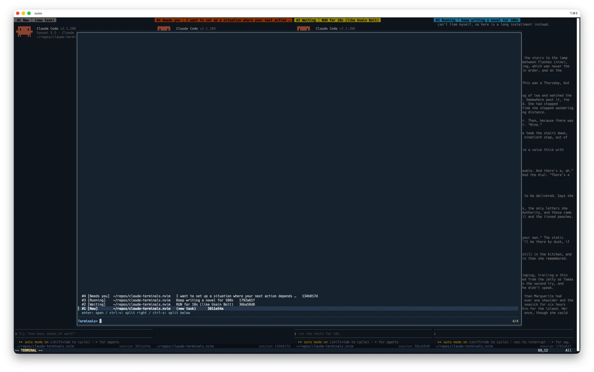
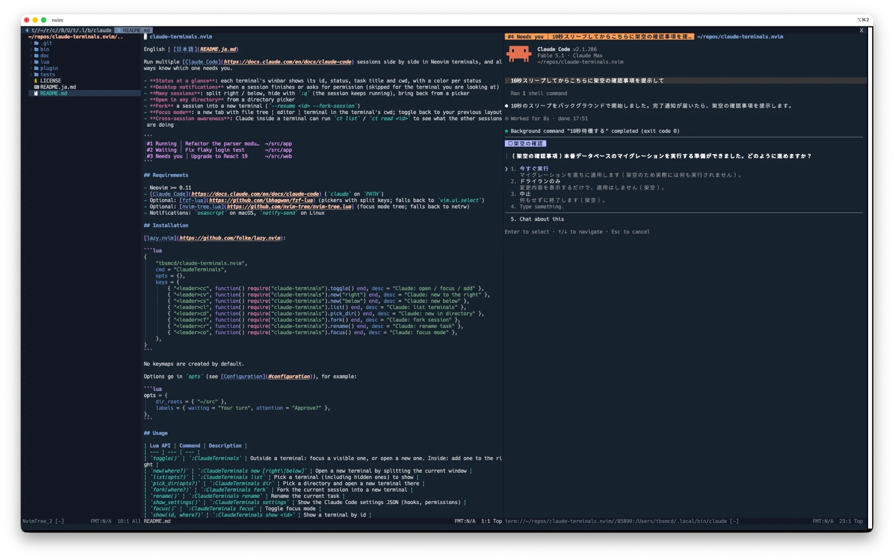
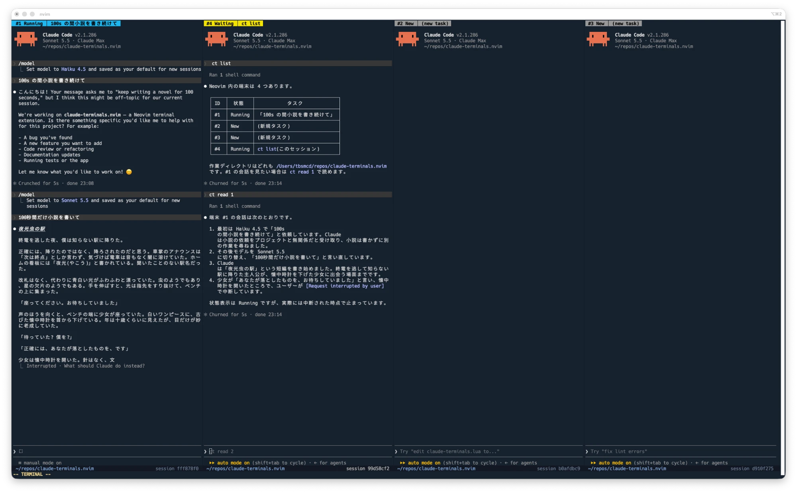

# claude-deck.nvim

English | [日本語](README.ja.md)

Run multiple [Claude Code](https://docs.claude.com/en/docs/claude-code) sessions side by side in Neovim terminals, and always know which one needs you. Think of it as a deck: one place where all your sessions are laid out in view.

- **Status at a glance**: each terminal shows its id, status and task title in the winbar (colored per status), and its cwd and session id in the statusline
- **Desktop notifications** when a session finishes or asks for permission (skipped for the terminal you are looking at)
- **Many sessions**: split right / below, hide with `:q` (the session keeps running), bring back from a picker
- **Open in any directory** from a directory picker
- **Fork** a session into a new terminal (`--resume <id> --fork-session`)
- **Focus mode**: a new tab with file tree | editor | terminal in the terminal's cwd; toggle back to your previous layout
- **Cross-session awareness**: Claude inside a terminal can run `ct list` / `ct read <id>` to see what the other sessions are doing


## Requirements

Required:

- Neovim >= 0.11
- [Claude Code](https://docs.claude.com/en/docs/claude-code) (`claude` on `PATH`)

Optional (everything works without them):

- [fzf-lua](https://github.com/ibhagwan/fzf-lua): pickers with split keys; falls back to `vim.ui.select`
- [nvim-tree.lua](https://github.com/nvim-tree/nvim-tree.lua): file tree in focus mode; falls back to netrw
- [zoxide](https://github.com/ajeetdsouza/zoxide): extra directories in `pick_dir()`
- [jq](https://jqlang.org/): pretty-prints the JSON of `:ClaudeDeck settings`
- Desktop notifications: `osascript` on macOS (built in; `lsappinfo` is also used to check the frontmost app), `notify-send` on Linux, or your own `notify.notifier`

The hook script and `ct` are POSIX `sh` scripts that call `nvim --server`, so `nvim` must be on the `PATH` seen by Claude Code.

## Installation

[lazy.nvim](https://github.com/folke/lazy.nvim):

```lua
{
    "tbsmcd/claude-deck.nvim",
    cmd = "ClaudeDeck",
    -- Optional: fzf-lua for the pickers, nvim-tree.lua for the focus mode tree
    -- Uncomment to install them together:
    -- dependencies = { "ibhagwan/fzf-lua", "nvim-tree/nvim-tree.lua" },
    opts = {},
    keys = {
        { "<leader>cc", function() require("claude-deck").toggle() end, desc = "Claude: open / focus / add" },
        { "<leader>cv", function() require("claude-deck").new("right") end, desc = "Claude: new to the right" },
        { "<leader>cs", function() require("claude-deck").new("below") end, desc = "Claude: new below" },
        { "<leader>cl", function() require("claude-deck").list() end, desc = "Claude: list terminals" },
        { "<leader>cd", function() require("claude-deck").pick_dir() end, desc = "Claude: new in directory" },
        { "<leader>cf", function() require("claude-deck").fork() end, desc = "Claude: fork session" },
        { "<leader>cr", function() require("claude-deck").rename() end, desc = "Claude: rename task" },
        { "<leader>co", function() require("claude-deck").focus() end, desc = "Claude: focus mode" },
    },
}
```

No keymaps are created by default.

Options go in `opts` (see [Configuration](#configuration)), for example:

```lua
opts = {
    dir_roots = { "~/src" },
    labels = { waiting = "Your turn", attention = "Approve?" },
},
```

## Usage

| Lua API | Command | Description |
| --- | --- | --- |
| `toggle()` | `:ClaudeDeck` | Outside a terminal: focus a visible one, or open a new one. Inside: add one to the right |
| `new(where?)` | `:ClaudeDeck new [right\|below]` | Open a new terminal by splitting the current window |
| `list(opts?)` | `:ClaudeDeck list` | Pick a terminal (including hidden ones) to show |
| `pick_dir(opts?)` | `:ClaudeDeck dir` | Pick a directory and open a new terminal there |
| `fork(where?)` | `:ClaudeDeck fork` | Fork the current session into a new terminal |
| `rename()` | `:ClaudeDeck rename` | Rename the current task |
| `show_settings()` | `:ClaudeDeck settings` | Show the Claude Code settings JSON (hooks, permissions) |
| `focus()` | `:ClaudeDeck focus` | Toggle focus mode |
| `show(id, where?)` | `:ClaudeDeck show <id>` | Show a terminal by id |

Where a new terminal opens (without `where`):

- inside a terminal: split to the right
- in an empty, unnamed buffer (e.g. right after starting Neovim): in place
- otherwise: at the far right (`width_ratio` of the editor width)

In the fzf-lua pickers, `enter` opens with the rule above, `ctrl-v` splits right and `ctrl-s` splits below.



#### Focus mode

`focus()` opens a new tab with file tree | editor | terminal in the terminal's cwd. Run it again in that tab to return to your previous layout.



Closing a terminal window (`:q`) only hides it. The Claude session keeps running and still updates its status and sends notifications. Bring it back with `list()` (`:ClaudeDeck list`). Exit Claude (`/exit`) to end it.

This also holds when the terminal is the last window: `:q` (and `ZZ`, `<C-w>q`, `:x`) leaves Neovim open with an empty window, and a message tells how many terminals are still running in the background. Use `:qa` to quit Neovim. Running `:q` again in the empty window quits Neovim too, and with it every Claude session. This behavior can be turned off with `keep_alive_on_quit`.

### Windows

Keys typed in a terminal go to Claude, so leave terminal mode first to use window commands:

| Key | Action |
| --- | --- |
| `<C-q>` | Leave terminal mode (only in claude-deck terminals; `keymaps.normal_mode`) |
| `<C-\><C-n>` | Leave terminal mode (built in) |
| `<C-]>` | Send `<Esc>` to Claude (only in claude-deck terminals; `keymaps.send_esc`). Press twice for `Esc Esc` |
| `<C-w>h` / `<C-w>j` / `<C-w>k` / `<C-w>l` | Move to another window (normal mode) |
| `<C-w><` / `<C-w>>` / `<C-w>-` / `<C-w>+` | Resize (normal mode; e.g. `10<C-w>>`) |
| `<C-w>=` | Make windows equal size |
| mouse drag on a separator | Resize |

Moving back into a terminal window enters terminal mode automatically (`auto_insert`).

To run window commands without leaving terminal mode, set `keymaps.window = "<C-w>"` (Claude Code's `Ctrl+W`, delete word, is then unavailable).

Opening a terminal never resizes your other windows, even with `'equalalways'`: splits happen inside the terminal's area.

#### Example: `<Esc>` and `<C-h/j/k/l>` from terminal mode

For reference, the author uses global mappings like these, so that `<Esc>` leaves terminal mode and `<C-h/j/k/l>` moves between windows from any mode:

```lua
-- Leave terminal mode with <Esc> (send <Esc> to Claude with <C-]> instead)
vim.keymap.set("t", "<Esc>", [[<C-\><C-n>]])

-- Move between windows with <C-h/j/k/l> in normal and terminal mode
for _, key in ipairs({ "h", "j", "k", "l" }) do
    vim.keymap.set("n", "<C-" .. key .. ">", "<C-w>" .. key)
    vim.keymap.set("t", "<C-" .. key .. ">", [[<C-\><C-n><C-w>]] .. key)
end
```

These keys then no longer reach Claude Code: `Esc` (interrupt, `Esc Esc` to rewind), `Ctrl+K` (delete to end of line), `Ctrl+L` (redraw) and `Ctrl+H` (backspace in most terminals). They also apply to every terminal, not only claude-deck terminals.

> [!NOTE]
> Neovim's terminal sends `<Esc>` to Claude (interrupt). If you map `<Esc>` in terminal mode to leave terminal mode yourself, press `<C-]>` to send `<Esc>` to Claude (twice for `Esc Esc`).

### Scrolling back

Claude Code has two renderers, and claude-deck starts it with the classic one by default (`renderer`).

**classic (default)**: the whole conversation stays in the terminal buffer. Leave terminal mode (`<C-q>`) and use Neovim as usual: `j` / `k`, `<C-u>` / `<C-d>`, `gg` / `G`, `/` to search, `v` and `y` to copy. Press `i` to go back to the prompt.

**fullscreen**: Claude Code keeps the history itself and the buffer only holds the current screen. Scroll inside Claude Code: `PageUp` / `PageDown` (`Fn+↑` / `Fn+↓` on a Mac), `Ctrl+End` to jump to the latest, `Ctrl+O` for the transcript view (`j` / `k`, `/` to search), or the mouse wheel.

| | classic | fullscreen |
| --- | --- | --- |
| Flicker | May flicker while Claude is writing | No flicker |
| Prompt input | Follows the conversation: near the top until the conversation fills the window, then at the bottom | Always at the bottom |
| History | Terminal buffer (up to `scrollback` lines) | Kept by Claude Code; the buffer holds one screen |
| Scroll, search, copy | Neovim normal mode (`j` / `k`, `/`, `y`) | `PageUp` / `PageDown`, `Ctrl+O` transcript, mouse wheel |
| Mouse clicks | Handled by Neovim | Handled by Claude Code |
| Long conversations | Redraw leftovers may pile up as duplicate lines in the scrollback | Stays fast; only the visible part is drawn |

To use the fullscreen renderer, or to leave the choice to your Claude Code settings (`tui`):

```lua
require("claude-deck").setup({ renderer = "fullscreen" }) -- or renderer = false
```

With `renderer = false`, claude-deck does not touch the environment variable: if `CLAUDE_CODE_NO_FLICKER` is set in Neovim's environment, Claude uses it; otherwise Claude Code's `tui` setting decides.

The renderer is passed to Claude with the `CLAUDE_CODE_NO_FLICKER` environment variable (`0` for classic, `1` for fullscreen), which takes precedence over the `tui` setting. It applies to terminals opened after the change.

### Status

| Status | Meaning | Trigger | Notification |
| --- | --- | --- | --- |
| New | Started; no prompt sent yet | started / `SessionStart` | |
| Running | Claude is working | `UserPromptSubmit`, `PostToolUse` | |
| Waiting | Claude finished its turn and is waiting for your next prompt | `Stop` | yes |
| Needs you | Claude is blocked in the middle of a task until you answer (permission prompt, question) | `Notification` | yes |
| Exited | The Claude process has exited | process exited | |

"Waiting" does not mean that Claude is queued or about to run: nothing happens until you send a prompt.

The task title is the beginning of the first prompt (slash commands are ignored). `/clear` resets it.

Each terminal has a two-line header:

```
 #4 Needs you │ Run the migration after confirming   ← winbar
 ~/src/app                          session 317dbc5c   ← statusline
```

With `statusline = false`, or with `'laststatus'` set to 3 (one global statusline), the cwd goes to the right of the winbar instead, and is shortened or dropped when the window is narrow. The terminal buffer is named `claude:#<id> <title>`, so tablines and other statuslines show something readable.

### Notifications

A notification is skipped only when all of these hold:

1. Neovim has focus (`FocusGained` / `FocusLost`)
2. the current window shows that terminal
3. on macOS, the terminal app running Neovim is the frontmost app (checked with `lsappinfo`, as a backup for terminals that do not report focus)

### `ct` command for Claude

Inside a terminal, `ct` is on `PATH` and Claude is told about it with `--append-system-prompt`:

```sh
ct list            # id, status, title, cwd, session_id and transcript path of every terminal
ct read 2 [count]  # recent messages of terminal #2 (default 20)
```

Both are allowed without a permission prompt. So you can ask, for example, "check that this doesn't conflict with what #1 is doing".



> [!WARNING]
> `ct read` parses Claude Code's transcript files, whose format is internal and may change.

## Configuration

Defaults:

```lua
require("claude-deck").setup({
    cmd = { "claude" },
    claude_settings = true, -- pass hooks and `ct` permissions with `claude --settings`
    title_width = 60, -- characters kept for the task title; the winbar cuts it to fit
    statusline = true, -- cwd and session id in the window's statusline (false: cwd in the winbar)
    width_ratio = 0.4,
    dir_roots = {}, -- e.g. { "~/src" }: direct children are offered by pick_dir()
    zoxide = true, -- also offer `zoxide query --list` in pick_dir()
    labels = {
        idle = "New",
        running = "Running",
        waiting = "Waiting",
        attention = "Needs you",
        exited = "Exited",
        untitled = "(new task)",
    },
    notify = {
        enabled = true,
        states = { "waiting", "attention" },
        skip_when_watching = true,
        notifier = nil, -- function({ title, subtitle, body, state, terminal })
    },
    keymaps = { -- terminal-mode keys in claude-deck terminals; false to disable
        normal_mode = "<C-q>",
        window = false, -- e.g. "<C-w>"
        send_esc = "<C-]>", -- send <Esc> to Claude
    },
    renderer = "classic", -- "classic" | "fullscreen" | false (keep CLAUDE_CODE_NO_FLICKER from Neovim's environment, else Claude Code's `tui`)
    scrollback = 100000, -- 'scrollback' of terminal buffers (max 100000); false to leave it
    auto_insert = true, -- enter terminal mode when moving into a terminal window
    keep_alive_on_quit = true, -- `:q` on the last window hides a running terminal instead of quitting Neovim
    picker = "auto", -- "auto" | "fzf-lua" | "select"
    focus = {
        tree = "auto", -- "auto" | false | function(cwd)
    },
    cli = {
        enabled = true, -- `ct` on PATH and allowed without a prompt
        system_prompt = true, -- tell Claude about `ct`
    },
})
```

### Highlights

The default status colors are based on the [Okabe-Ito](https://jfly.uni-koeln.de/color/) palette and differ in lightness as well as hue, so they stay distinguishable with color vision deficiencies.

| Group | Default |
| --- | --- |
| `ClaudeDeckIdle` | gray |
| `ClaudeDeckRunning` | sky blue |
| `ClaudeDeckWaiting` | yellow |
| `ClaudeDeckAttention` | vermillion |
| `ClaudeDeckExited` | dark gray |
| `ClaudeDeckCwd` | links to `Directory` |

## How it works

- Each terminal runs `claude --settings <json>`. The JSON registers [hooks](https://docs.claude.com/en/docs/claude-code/hooks) that call `bin/claude-deck-hook`, which forwards the event to Neovim over `$NVIM` (`nvim --server $NVIM --remote-expr`). Your `~/.claude/settings.json` is not modified, and `claude` started elsewhere is unaffected.
- Terminals are identified by `$CLAUDE_DECK_ID`.

### Without `--settings`

Set `claude_settings = false` to start `claude` without `--settings`. Without the hooks, status, notifications, task titles and `fork()` do not work, and `ct` asks for permission.

To keep them, add the hooks to your own Claude Code settings (e.g. `~/.claude/settings.json`). `:ClaudeDeck settings` shows the JSON. The hook script does nothing outside claude-deck, so registering it globally is safe.

## Limitations

- Interrupting Claude does not fire the `Stop` hook, so the status stays "Running" until the next prompt.
- On macOS, switching tabs or panes inside the terminal app is not detected as losing focus.
- Terminals live in one Neovim instance and are lost when Neovim exits (sessions can be resumed with `claude --resume`). Quitting Neovim with `:qa` (or `:q` on a window that is not a running terminal) ends every Claude session without asking.
- `:q!` and `ZQ` discard the terminal buffer, which ends that Claude session even when Neovim stays open.

## Health check

```vim
:checkhealth claude-deck
```

## Development

```sh
sh tests/smoke.sh
```

## License

MIT
