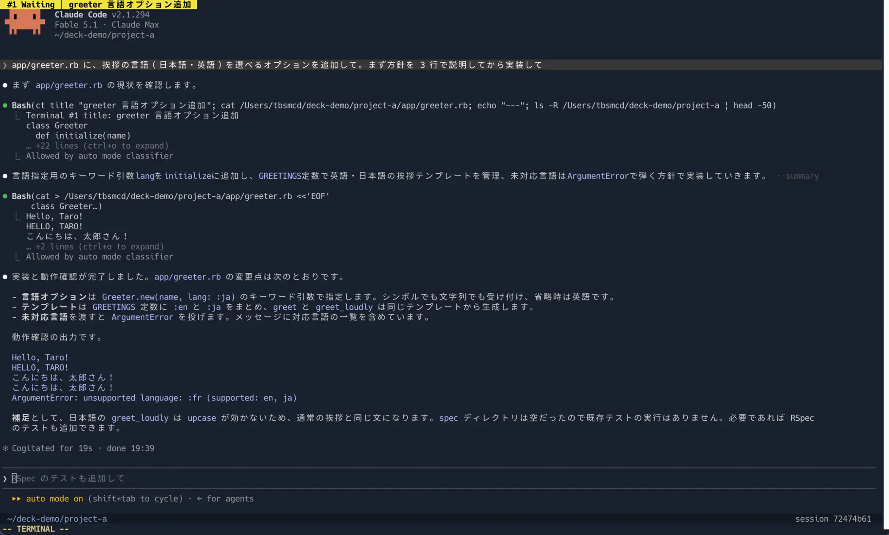
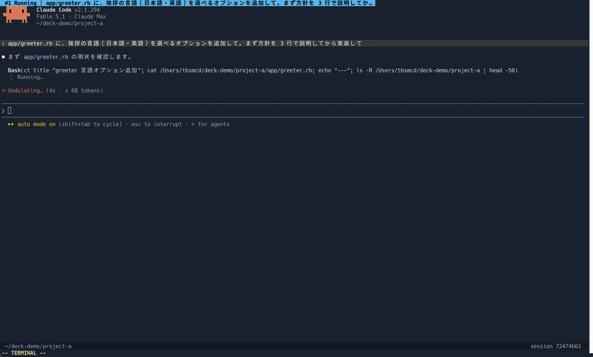
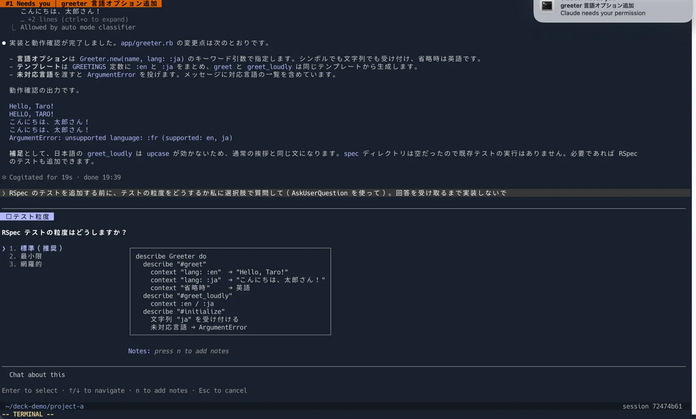
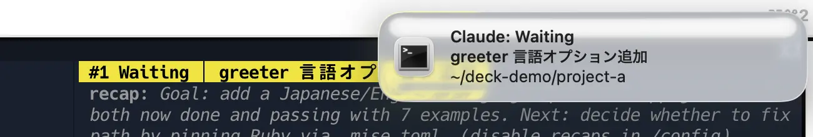
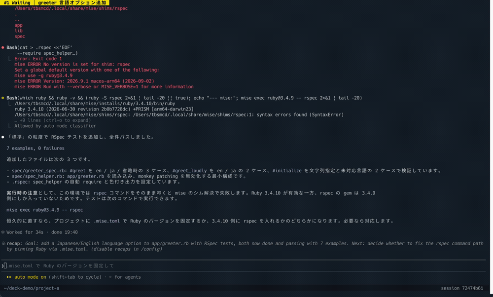
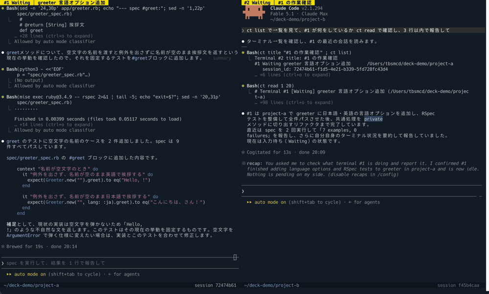
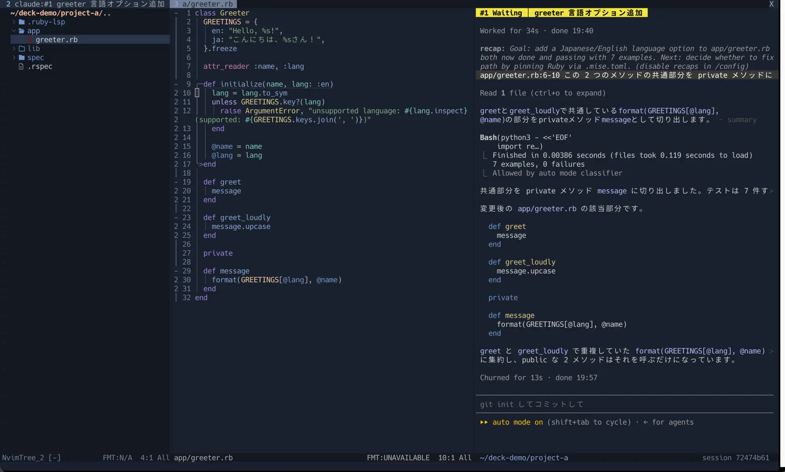
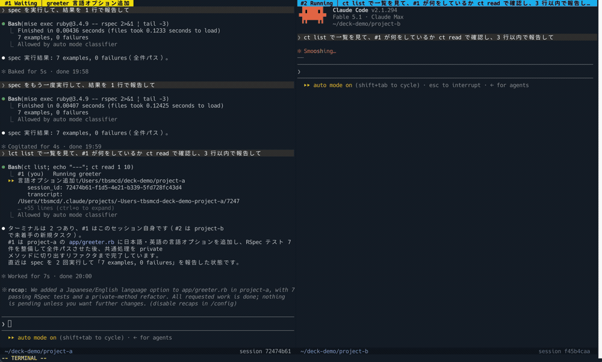
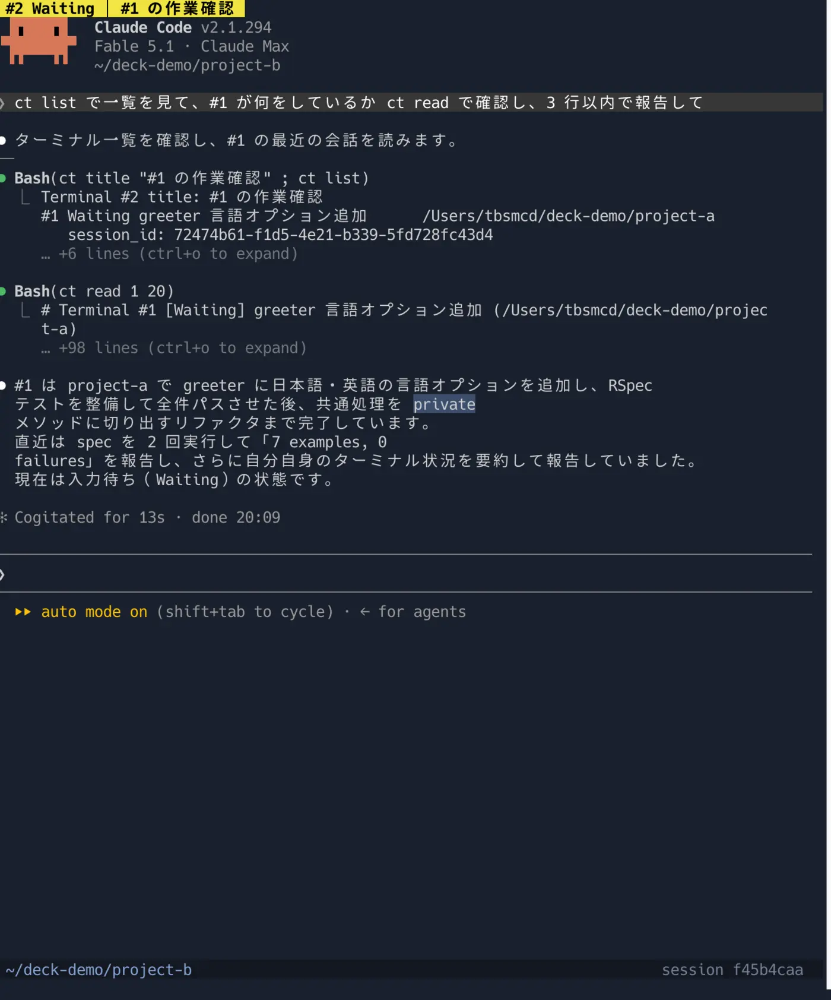

# claude-deck.nvim 使い方ガイド

[English](guide.md) | 日本語

このガイドは、claude-deck.nvim をインストールしたあとの使い方を、実際の作業の流れに沿って説明します。設定項目の一覧は [README](../README.ja.md) とヘルプ（`:help claude-deck`）を参照してください。

## 0. このガイドの前提

claude-deck.nvim はキーを割り当てません。このガイドは、次の設定がある前提で書いています。自分の `init.lua` が違う場合は読み替えてください。

| 項目 | このガイドの前提 | どこで決まるか |
|---|---|---|
| `<leader>` | Space（`vim.g.mapleader = " "`） | 自分の `init.lua` |
| `<leader>cc` などのキー | README のインストール例（lazy.nvim の `keys`）どおり | 自分の `init.lua` |
| `<leader>cp` | `send_location()` を `mode = { "n", "x" }` で割り当てている | 自分の `init.lua` |
| ターミナルモードの `<Esc>` | `<Esc>` でターミナルモードを抜ける mapping がある（README の参考設定） | 自分の `init.lua` |
| `<C-h>` / `<C-j>` / `<C-k>` / `<C-l>` | ノーマルモードとターミナルモードで window を移動する mapping がある（README の参考設定） | 自分の `init.lua` |
| fzf-lua、nvim-tree.lua | 入っている（一覧の分割キー、ディレクトリのたどり、集中モードのツリーに使う） | 自分のプラグイン設定 |
| `laststatus` | `2`（window ごとのステータスライン。`3` にすると 2 行目は winbar にまとまる） | 自分の `init.lua` |
| `dir_roots` | `{ "~/repos" }`（`<leader>cd` の候補にする場所） | プラグインの `opts` |
| `terminal-notifier` | インストール済み（macOS で通知のクリックからターミナルに戻るため） | `brew install terminal-notifier` |

このほかの設定（表示方式、通知の遅延、`<C-q>` と `<C-]>` など）は、プラグインの既定値のままです。

## 1. このプラグインでできること

claude-deck.nvim は、Neovim のターミナルで Claude Code を複数同時に動かし、それぞれの状態をひと目で分かるようにするプラグインです。

- ターミナルごとに「番号・状態・タスク名」が色付きで表示される
- Claude が入力待ちや確認待ちになると、デスクトップに通知が届く
- ターミナルを閉じても Claude は裏で動き続け、あとから呼び戻せる
- コードを見ながら Claude に相談するための集中モードがある
- ターミナルの中の Claude が、ほかのターミナルの会話を読める

「デッキ」は、複数のセッションを 1 か所に並べて見渡す場所、という意味です。

## 2. 画面の見方

ターミナルの上と下に、2 行の情報が出ます（下の行は、`laststatus` が `3` のときは winbar の右側にまとまります）。

```
 #2 Running │ パーサーの分割                 ← winbar（番号・状態・タスク名）
 （Claude Code の画面）
 ~/repos/app                 session 1a2b3c4d  ← ステータスライン（cwd・セッション ID）
```

状態は 5 つで、色で見分けられます。

| 状態 | 色 | 意味 |
|---|---|---|
| New | グレー | 起動した直後。まだプロンプトを送っていない |
| Running | 空色 | Claude が作業中 |
| Waiting | 黄 | Claude が応答を終え、次のプロンプトを待っている |
| Needs you | 朱 | 許可の確認や質問で、あなたの回答を待って止まっている |
| Exited | 暗いグレー | Claude のプロセスが終了した |

Waiting は「Claude があなたの番だと言っている」状態です。あなたが何か送るまで、何も進みません。




タスク名は、Claude がタスクを把握した時点で自分で付けます（20 文字程度）。それまでは最初のプロンプトの先頭が仮の名前として表示されます。



自分で付けたい場合は `<leader>cr` です。自分で付けた名前は、Claude が勝手に変えることはありません（「名前を変えて」と頼めば変えます）。

## 3. 基本の流れ

### 開く

ノーマルモードで `<leader>cc` を押すと、Claude Code のターミナルが開きます。

- 空の画面で押すと、その場（全画面）に開きます
- ファイルを開いているときは、右端に開きます
- すでにターミナルの中にいるときは、右隣にもう 1 つ開きます

開いたときのディレクトリは、Neovim のカレントディレクトリです。別の場所で開きたいときは `<leader>cd` を使います（4 章）。

### タスクを伝える

ターミナルはすぐに入力できる状態（ターミナルモード）になります。Claude Code の入力欄にそのままタスクを打って送信してください。

送信すると状態が Running になり、しばらくして Waiting か Needs you になります。




### 通知を受け取る

ほかの作業をしている間に Claude が止まると、デスクトップ通知が届きます。通知をクリックすると、ターミナルアプリ（iTerm2 など）が前面に出ます。

通知は、そのターミナルを見ているときには出ません。別のウィンドウや別のアプリを見ているときだけ届きます。




### ほかの window に移る

ターミナルの中では、押したキーがすべて Claude に送られます。Neovim の操作に戻るには、まずターミナルモードを抜けてください。

| キー | 動作 |
|---|---|
| `<C-q>` | ターミナルモードを抜ける（claude-deck のターミナルだけで有効） |
| `<C-\><C-n>` | 同上（Neovim 標準） |
| `<Esc>` | 同上。ただし 0 章の前提設定（自分の `init.lua` の mapping）によるもので、プラグインの機能ではない |
| `<C-]>` | Claude に Esc を送る（処理の中断、ダイアログを閉じる。2 回で巻き戻しメニュー） |

ターミナルモードを抜けたあとは、`<C-w>h` などで普通に window を移動できます。0 章の前提設定なら、`<C-h>` / `<C-j>` / `<C-k>` / `<C-l>` でターミナルモードのまま移動することもできます。ターミナルの window に戻ると、自動でターミナルモードに戻ります。

`<Esc>` をターミナルモードを抜けるキーに割り当てている場合、`<Esc>` は Claude に届きません。Claude に Esc を送りたいときは `<C-]>` を使ってください。この割り当てがなければ、`<Esc>` はそのまま Claude に届きます。

### 閉じる・呼び戻す

ターミナルの window は `:q` で閉じられます。閉じても Claude は裏で動き続け、状態の更新と通知も続きます。

呼び戻すには `<leader>cl` で一覧を開き、選びます。

| 一覧でのキー | 動作 |
|---|---|
| `Enter` | 開く（空の画面ならその場、ターミナルの中なら右隣、それ以外は右端） |
| `Ctrl-v` | 右に分割して開く |
| `Ctrl-s` | 下に分割して開く |

window が 1 つだけのときに `:q` しても、Neovim は終了しません。ターミナルが非表示になり、空の画面が残ります（裏で動いている数がメッセージで出ます）。Neovim ごと終了したいときは `:qa` を使います。このとき、裏の Claude も終了します。


Claude を終了するには、Claude の入力欄で `/exit` を実行します。

## 4. 複数のターミナルを扱う

### 分割して増やす

| キー | 動作 |
|---|---|
| `<leader>cv` | 今の window の右に新しいターミナルを開く |
| `<leader>cs` | 今の window の下に新しいターミナルを開く |

新しいターミナルは、今いるターミナルと同じディレクトリで開きます。ほかの window の大きさは変わりません。

### 別のディレクトリで開く

`<leader>cd` でディレクトリの一覧が開きます。候補は次の順です。

1. 今のディレクトリ
2. 今のディレクトリの直下
3. 開いているターミナルのディレクトリ
4. 設定した場所（`dir_roots`）の直下。0 章の前提設定では `~/repos` の直下
5. zoxide の履歴

| 一覧でのキー | 動作 |
|---|---|
| `Enter` / `Ctrl-v` / `Ctrl-s` | そのディレクトリで開く |
| `Tab` | そのディレクトリの中に入る |
| `Shift-Tab` | 1 つ上に戻る |

`Tab` で何階層でもたどれます。途中の階層で `Enter` を押せば、そこで開きます。




### 会話を分岐する

ターミナルの中で `<leader>cf` を押すと、同じ会話の続きを別のターミナルで開きます。「ここから別の案も試したい」というときに使います。元のターミナルはそのまま残ります。

## 5. コードを見ながら相談する（集中モード）

ターミナルの中で `<leader>co` を押すと、新しいタブに「ファイルツリー ｜ エディタ ｜ そのターミナル」が並びます。タブのカレントディレクトリは、そのターミナルのディレクトリになります。

もう一度 `<leader>co` を押すと、タブが閉じて元の画面構成に戻ります。

### ファイルと行を Claude に渡す

集中モードのエディタ側で `<leader>cp` を押すと、今のファイルと行が Claude の入力欄に入ります。

- ノーマルモード: カーソルの行。例: `app/services/example.rb:24`
- ビジュアルモード（`V` で行を選ぶ）: 選んだ範囲。例: `app/services/example.rb:24-58`

入力欄にはパスと行だけが入り、フォーカスがターミナルに移ります。続けて「ここを共通化したい」のように打って送信してください。自動では送信しません。

集中モード以外のタブでも、表示しているターミナルが 1 つだけなら使えます。






## 6. 会話をさかのぼる

Claude Code の画面から流れてしまった会話は、Neovim の普通のバッファと同じ操作で読み返せます。

1. `<C-q>` でターミナルモードを抜ける
2. `k`、`Ctrl-u`、`gg` などでさかのぼる。`/` で検索、`v` と `y` でコピーもできる
3. `i` でターミナルモードに戻る（最新の位置に戻ります）




これは、ターミナルが Claude Code を「従来の表示」で起動しているためです。この表示では、会話が短いうちは入力欄が画面の上のほうにあり、会話が画面を埋めてからは下に落ち着きます。

入力欄を常に下に固定したい場合は、設定で `renderer = "fullscreen"` にします。その場合、さかのぼる操作は Claude Code 側のキー（`PageUp` / `PageDown`、`Ctrl+O` で transcript 表示）になります。

## 7. Claude 同士の連携（`ct` コマンド）

ターミナルの中の Claude は、`ct` コマンドでほかのターミナルの様子を確認できます。Claude には起動時にこのコマンドのことを伝えてあるので、次のように頼むだけで使います。

- 「#1 の進み具合を見て」
- 「ほかのターミナルの作業と矛盾しないか確認して」

| コマンド | 内容 |
|---|---|
| `ct list` | 全ターミナルの番号・状態・タスク名・ディレクトリ・セッション ID |
| `ct read 2` | ターミナル #2 の直近の会話（既定 20 件） |
| `ct title "名前"` | 自分のターミナルに名前を付ける |

どれも許可の確認なしで実行されます。`ct read` は記録済みの会話を読むだけなので、相手が出力している途中の内容は、その発言が終わるまで見えません。




## 8. 通知の仕組み

通知は、状態が Waiting か Needs you になったときに送られます。ただし次の場合は送りません。

- そのターミナルを見ているとき（Neovim にフォーカスがあり、そのターミナルの window にいて、ターミナルアプリが最前面）
- 2 秒以内に Running に戻ったとき（バックグラウンド処理の完了で Claude が自動で再開した場合など）

macOS では、`terminal-notifier` が入っていると、通知のクリックでターミナルアプリに戻れます（`brew install terminal-notifier`）。初回は、システム設定の「通知」で `terminal-notifier` を許可する必要があります。通知が出ないときは、Neovim にその理由がメッセージで表示されます。

## 9. 困ったとき

| 症状 | 確認すること |
|---|---|
| 通知が来ない | `:checkhealth claude-deck` で通知の方法を確認する。macOS ではシステム設定の「通知」で `terminal-notifier` を許可する |


| 状態が Running のまま変わらない | Claude を中断したあとは、次のプロンプトを送るまで Running のままです（仕様） |
| `<Esc>` を押しても Claude が止まらない | Neovim 側で `<Esc>` を別の用途に割り当てています。`<C-]>` を使ってください |
| タスク名が消えた | Claude で `/clear` すると、Claude が付けた名前は消えます。自分で付けた名前は残ります |
| `:q` で Neovim が終了しない | window が 1 つだけでターミナルを閉じたときの仕様です。`:qa` で終了します |
| 一覧やディレクトリの選択で `Tab` などが効かない | fzf-lua が入っていません。入れると分割キーやディレクトリのたどりが使えます |

## 10. キーの一覧

0 章の前提設定（README のインストール例）での割り当てです。`<Esc>` と `<C-h>` などの mapping は自分の `init.lua` によるものです。

| キー | 動作 |
|---|---|
| `<leader>cc` | 開く / 移動 / 右に追加 |
| `<leader>cv` | 右に分割して開く |
| `<leader>cs` | 下に分割して開く |
| `<leader>cl` | ターミナルの一覧 |
| `<leader>cd` | ディレクトリを選んで開く |
| `<leader>cf` | 会話を分岐する |
| `<leader>cr` | タスク名を変える |
| `<leader>co` | 集中モードの切り替え |
| `<leader>cp` | ファイルと行を Claude に渡す |
| `<C-q>`（ターミナル内） | ターミナルモードを抜ける |
| `<C-]>`（ターミナル内） | Claude に Esc を送る |

コマンドで実行する場合は `:ClaudeDeck` に続けてサブコマンドを指定します（`new`、`list`、`dir`、`fork`、`rename`、`focus`、`location`、`show`、`settings`）。
