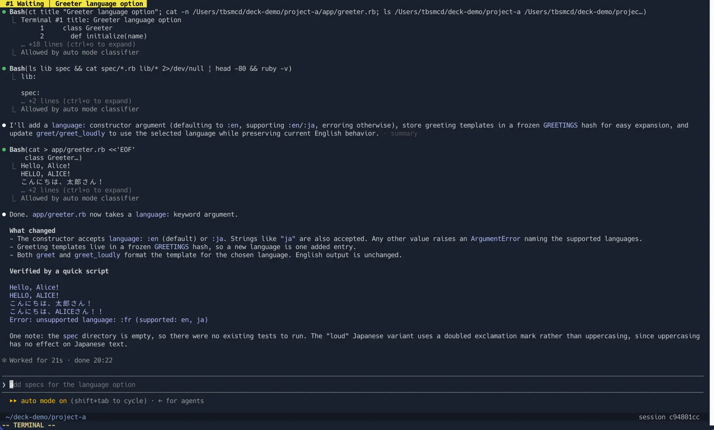
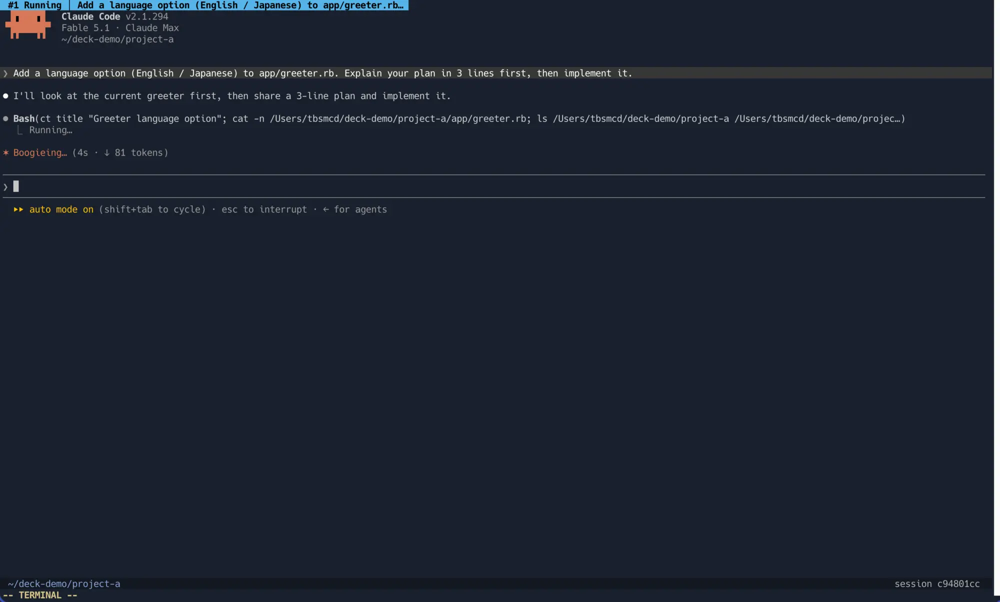
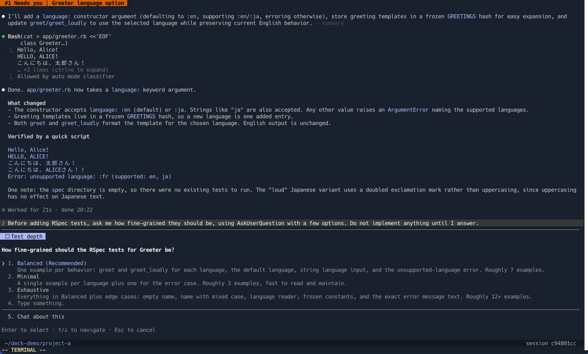
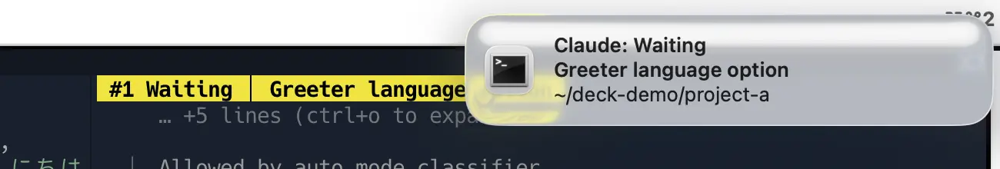
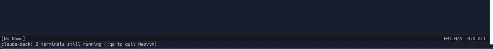
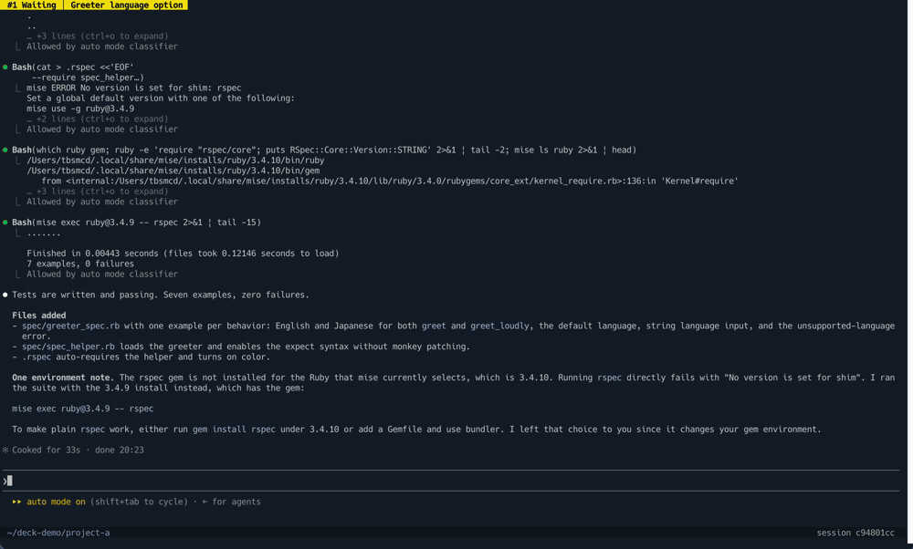
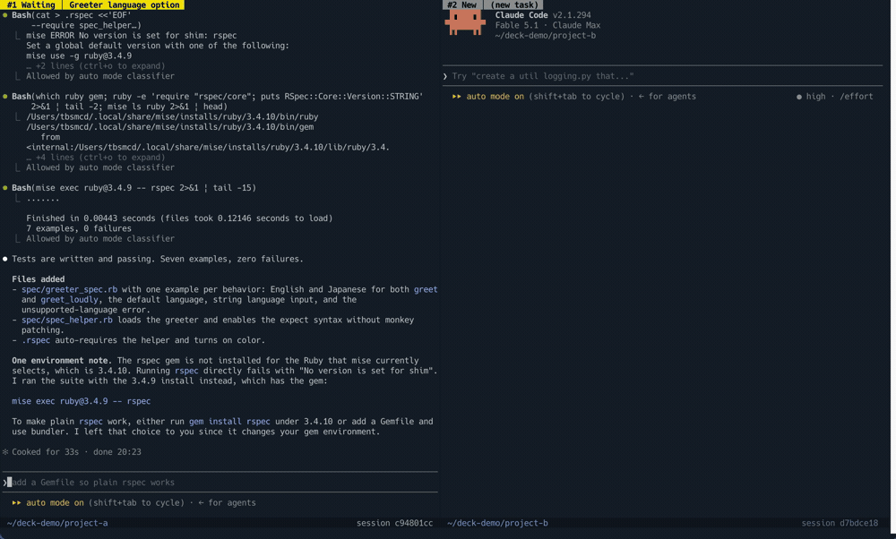
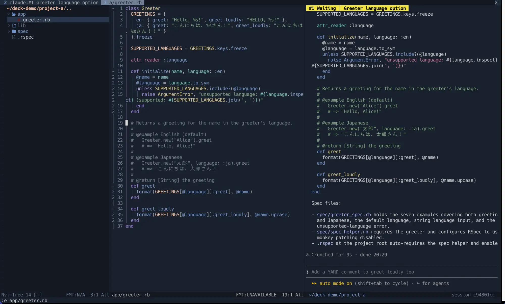
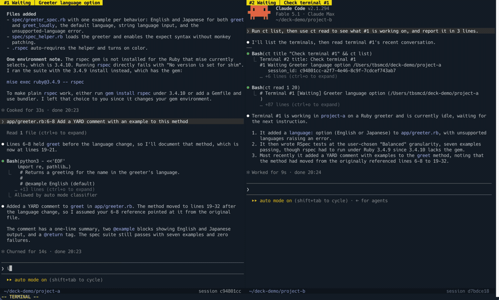
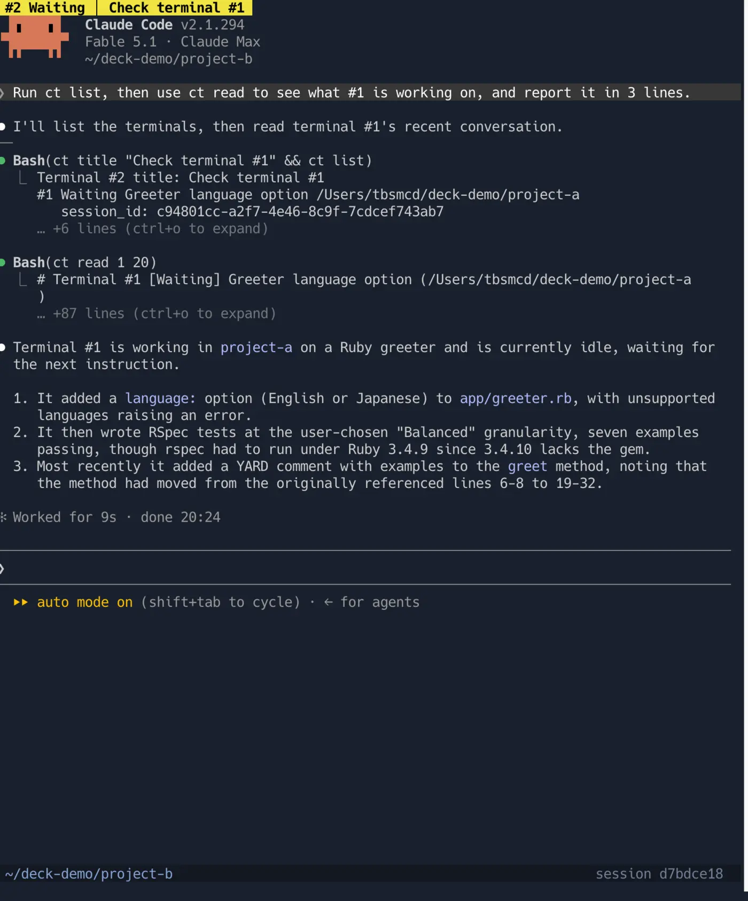

# claude-deck.nvim User Guide

English | [日本語](guide.ja.md)

This guide walks through using claude-deck.nvim after you install it, following a typical session. For the full list of options, see the [README](../README.md) and the help (`:help claude-deck`).

## 0. Assumptions in this guide

claude-deck.nvim does not create any keymaps. This guide assumes the settings below. If your own `init.lua` differs, read the guide accordingly.

| Item | Assumed in this guide | Where it is set |
|---|---|---|
| `<leader>` | Space (`vim.g.mapleader = " "`) | Your `init.lua` |
| Keys such as `<leader>cc` | As in the README installation example (lazy.nvim `keys`) | Your `init.lua` |
| `<leader>cp` | `send_location()` is mapped with `mode = { "n", "x" }` | Your `init.lua` |
| `<Esc>` in terminal mode | A mapping leaves terminal mode with `<Esc>` (the README's example) | Your `init.lua` |
| `<C-h>` / `<C-j>` / `<C-k>` / `<C-l>` | Mappings move between windows in normal and terminal mode (the README's example) | Your `init.lua` |
| fzf-lua, nvim-tree.lua | Installed (used for the split keys in the lists, directory browsing, and the focus mode tree) | Your plugin setup |
| `laststatus` | `2` (a statusline per window; with `3`, the second line moves into the winbar) | Your `init.lua` |
| `dir_roots` | `{ "~/repos" }` (the place offered by `<leader>cd`) | The plugin's `opts` |
| `terminal-notifier` | Installed (so that clicking a notification on macOS brings back the terminal app) | `brew install terminal-notifier` |

Everything else (the renderer, the notification delay, `<C-q>` and `<C-]>`, and so on) is left at the plugin's defaults.

## 1. What this plugin does

claude-deck.nvim runs several Claude Code sessions at once in Neovim terminals and lets you see the state of each one at a glance.

- Each terminal shows its number, status and task title, colored by status
- You get a desktop notification when Claude is waiting for input or for your answer
- Closing a terminal does not stop Claude: it keeps running in the background, and you can bring it back later
- Focus mode lets you talk to Claude while looking at your code
- Claude in one terminal can read the conversations in the other terminals

"Deck" means a place where several sessions are laid out so you can see them all.

## 2. Reading the screen

Each terminal has two lines of information, one above and one below (with `laststatus` set to `3`, the lower line moves to the right side of the winbar).

```
 #2 Running │ Split the parser                 ← winbar (number, status, task title)
 (Claude Code screen)
 ~/repos/app                 session 1a2b3c4d  ← statusline (cwd, session id)
```

There are five statuses, told apart by color.

| Status | Color | Meaning |
|---|---|---|
| New | Gray | Just started. No prompt sent yet |
| Running | Sky blue | Claude is working |
| Waiting | Yellow | Claude finished its turn and is waiting for your next prompt |
| Needs you | Vermillion | Claude is stopped, waiting for your answer to a permission prompt or a question |
| Exited | Dark gray | The Claude process has exited |

Waiting means "Claude says it is your turn". Nothing moves forward until you send something.



Claude names the task itself once it understands the task (about 20 characters). Until then, the beginning of the first prompt is shown as a temporary title.


To name it yourself, use `<leader>cr`. Claude never changes a title you set yourself (it will if you ask it to rename the terminal).

## 3. The basic flow

### Open

Press `<leader>cc` in normal mode to open a Claude Code terminal.

- On an empty screen, it opens in place (full screen)
- When you have a file open, it opens at the far right
- When you are already inside a terminal, it opens another one to the right

The terminal opens in Neovim's current directory. To open it somewhere else, use `<leader>cd` (chapter 4).

### Give it a task

The terminal is ready for input right away (terminal mode). Type your task in Claude Code's prompt input and send it.

Once you send it, the status becomes Running, and after a while it becomes Waiting or Needs you.



### Get notified

If Claude stops while you are doing something else, you get a desktop notification. Clicking it brings the terminal app (iTerm2, for example) to the front.

No notification is sent while you are looking at that terminal. You get one only when you are looking at another window or another app.



### Move to other windows

Inside a terminal, every key you press goes to Claude. To get back to Neovim commands, leave terminal mode first.

| Key | Action |
|---|---|
| `<C-q>` | Leave terminal mode (only in claude-deck terminals) |
| `<C-\><C-n>` | Same (built into Neovim) |
| `<Esc>` | Same. This comes from the assumed setup in chapter 0 (a mapping in your own `init.lua`), not from the plugin |
| `<C-]>` | Send Esc to Claude (interrupt, close a dialog; press twice for the rewind menu) |

After leaving terminal mode, you can move between windows as usual with `<C-w>h` and so on. With the setup in chapter 0, you can also move with `<C-h>` / `<C-j>` / `<C-k>` / `<C-l>` without leaving terminal mode. When you move back into the terminal window, it returns to terminal mode automatically.

If you mapped `<Esc>` in Neovim to leave terminal mode, `<Esc>` does not reach Claude. Use `<C-]>` to send Esc to Claude. Without that mapping, `<Esc>` reaches Claude as it is.

### Close and bring back

You can close a terminal window with `:q`. Claude keeps running in the background, and status updates and notifications continue.

To bring it back, open the list with `<leader>cl` and pick a terminal.

| Key in the list | Action |
|---|---|
| `Enter` | Open (in place on an empty screen, to the right inside a terminal, at the far right otherwise) |
| `Ctrl-v` | Open in a split to the right |
| `Ctrl-s` | Open in a split below |

If you run `:q` when there is only one window, Neovim does not quit. The terminal is hidden and an empty window is left (a message tells you how many terminals are running in the background). To quit Neovim itself, use `:qa`. This also ends the Claude sessions running in the background.



To end Claude, run `/exit` in Claude's prompt input.

## 4. Working with several terminals

### Split to add more

| Key | Action |
|---|---|
| `<leader>cv` | Open a new terminal to the right of the current window |
| `<leader>cs` | Open a new terminal below the current window |

A new terminal opens in the same directory as the terminal you are in. The size of your other windows does not change.

### Open in another directory

`<leader>cd` opens a directory list. The candidates come in this order:

1. The current directory
2. The directories directly under the current directory
3. The directories of open terminals
4. The directories directly under the places you configured (`dir_roots`). With the setup in chapter 0, this is the directories directly under `~/repos`
5. zoxide history

| Key in the list | Action |
|---|---|
| `Enter` / `Ctrl-v` / `Ctrl-s` | Open in that directory |
| `Tab` | Go into that directory |
| `Shift-Tab` | Go back up one level |

You can go down as many levels as you like with `Tab`. Press `Enter` at any level to open there.



### Fork a conversation

Press `<leader>cf` inside a terminal to continue the same conversation in another terminal. Use it when you want to try a different approach from this point. The original terminal stays as it is.

## 5. Discussing code while looking at it (focus mode)

Press `<leader>co` inside a terminal, and a new tab opens with file tree | editor | that terminal. The tab's current directory is the terminal's directory.

Press `<leader>co` again, and the tab closes and your previous layout comes back.

### Send the file and line to Claude

In the editor of focus mode, press `<leader>cp` to insert the current file and line into Claude's prompt input.

- Normal mode: the cursor line, e.g. `app/services/example.rb:24`
- Visual mode (select lines with `V`): the selected lines, e.g. `app/services/example.rb:24-58`

Only the path and line go into the prompt input, and focus moves to the terminal. Go on typing something like "I want to share this logic" and send it. Nothing is sent automatically.

It also works in tabs other than focus mode, as long as exactly one terminal is visible.





## 6. Scrolling back through the conversation

You can reread a conversation that has scrolled off the Claude Code screen with the usual Neovim buffer operations.

1. Leave terminal mode with `<C-q>`
2. Scroll back with `k`, `Ctrl-u`, `gg` and so on. You can also search with `/` and copy with `v` and `y`
3. Press `i` to return to terminal mode (you go back to the latest position)



This works because the terminal starts Claude Code with the classic renderer. With this renderer, the prompt input sits near the top while the conversation is short, and settles at the bottom once the conversation fills the screen.

If you want the prompt input always fixed at the bottom, set `renderer = "fullscreen"`. In that case, you scroll back with Claude Code's own keys (`PageUp` / `PageDown`, and `Ctrl+O` for the transcript view).

## 7. Claude working with Claude (the `ct` command)

Claude in a terminal can check on the other terminals with the `ct` command. Claude is told about this command when it starts, so you just ask in plain words, for example:

- "Check how #1 is going"
- "Check that this doesn't conflict with the work in the other terminals"

| Command | Description |
|---|---|
| `ct list` | Number, status, task title, directory and session id of every terminal |
| `ct read 2` | Recent conversation of terminal #2 (20 messages by default) |
| `ct title "name"` | Set the title of its own terminal |

All of them run without a permission prompt. `ct read` only reads the conversation that has been recorded, so you cannot see what the other side is in the middle of writing until that message is finished.



## 8. How notifications work

A notification is sent when the status becomes Waiting or Needs you. It is not sent in these cases:

- You are looking at that terminal (Neovim has focus, you are in that terminal's window, and the terminal app is frontmost)
- The status went back to Running within 2 seconds (for example, Claude resumed by itself when a background process finished)

On macOS, if `terminal-notifier` is installed, clicking a notification brings you back to the terminal app (`brew install terminal-notifier`). The first time, you need to allow `terminal-notifier` under "Notifications" in System Settings. When no notification appears, Neovim shows the reason in a message.

## 9. Troubleshooting

| Symptom | What to check |
|---|---|
| No notifications | Check the notification method with `:checkhealth claude-deck`. On macOS, allow `terminal-notifier` under "Notifications" in System Settings |
| The status stays Running | After you interrupt Claude, it stays Running until you send the next prompt (by design) |
| Claude does not stop when I press `<Esc>` | You mapped `<Esc>` to something else in Neovim. Use `<C-]>` |
| The task title disappeared | `/clear` in Claude removes the title Claude set. A title you set yourself stays |
| `:q` does not quit Neovim | This is the behavior when you close a terminal in the only window. Use `:qa` to quit |
| `Tab` and other keys do not work in the lists or the directory picker | fzf-lua is not installed. Install it to get the split keys and directory browsing |

## 10. Key reference

These are the mappings from the setup in chapter 0 (the README installation example). The mappings for `<Esc>` and `<C-h>` etc. come from your own `init.lua`.

| Key | Action |
|---|---|
| `<leader>cc` | Open / move to / add to the right |
| `<leader>cv` | Open in a split to the right |
| `<leader>cs` | Open in a split below |
| `<leader>cl` | List terminals |
| `<leader>cd` | Pick a directory and open there |
| `<leader>cf` | Fork the conversation |
| `<leader>cr` | Rename the task |
| `<leader>co` | Toggle focus mode |
| `<leader>cp` | Send the file and line to Claude |
| `<C-q>` (in a terminal) | Leave terminal mode |
| `<C-]>` (in a terminal) | Send Esc to Claude |

To run them as commands, use `:ClaudeDeck` followed by a subcommand (`new`, `list`, `dir`, `fork`, `rename`, `focus`, `location`, `show`, `settings`).
